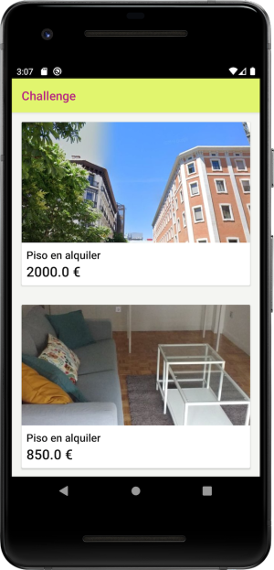

## Getting started

This repository contains an Android app that retrieves a list of ads.

  

This is a multi-module project which contains three different modules: ``app``, ``core`` and ``list``. Application entry point is ``ListActivity`` located at ``list`` module

## Tasks

Your task is to **clone** this repository and take into consideration next steps

###### Before start
Damn it! It seems the project has some kind of errors...could you help us to fix them and get project running great again before start?

###### New features to add

1. Go to an ad detail from ads list.
2. Favourite ads

###### Some optional tasks to do (bonus):

1. Some tests could be great idea
2. Feel free to develop any new features or improvements
